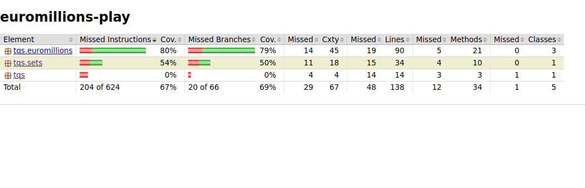
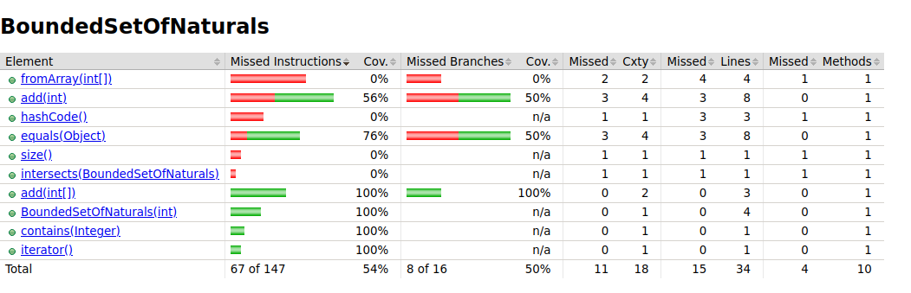
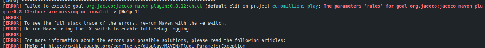
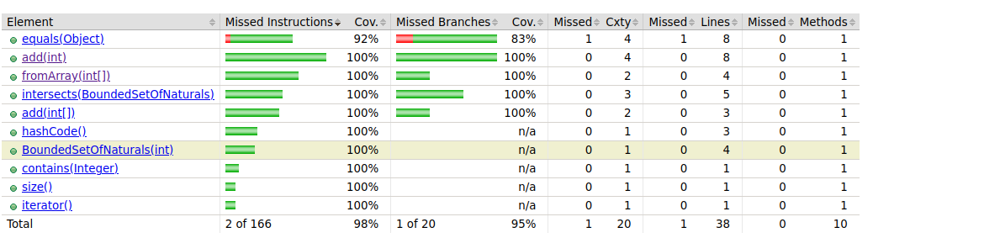

## Comandos a Utilizar

### mvn clean test jacoco:report
- Para Obter um relatorio com as pencentagem de test coverage
### mvn clean test jacoco:check
- Para correr os teste com regras que expecificamos no pom do Jacoco

## Imagem com a percentagem de test coverage do exercicio 2 inteiro 

## Imagem com a percentagem de coverage da Classe BoundedSetOfNaturals inicial

## Com a regra no Jococo que nessecita de teste coverage de 90% ocorre um erro quando corremos os testes.

## Imagem com a percentagem de coverage da Classe BoundedSetOfNaturals final depois de fazer reestrutura de teste e de criação de novos testes.Tambem uma pequena alteração da Class BoundedSetOfNaturals
